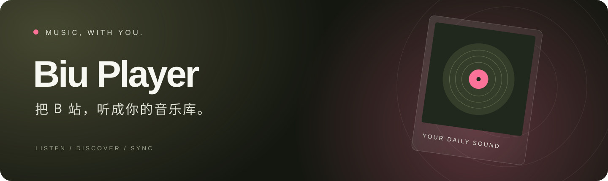
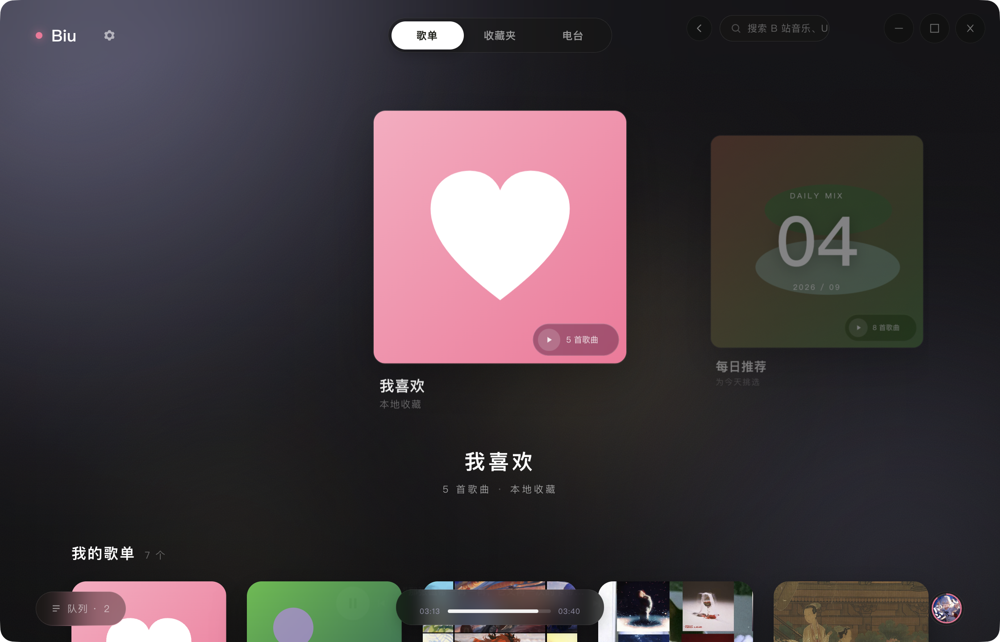
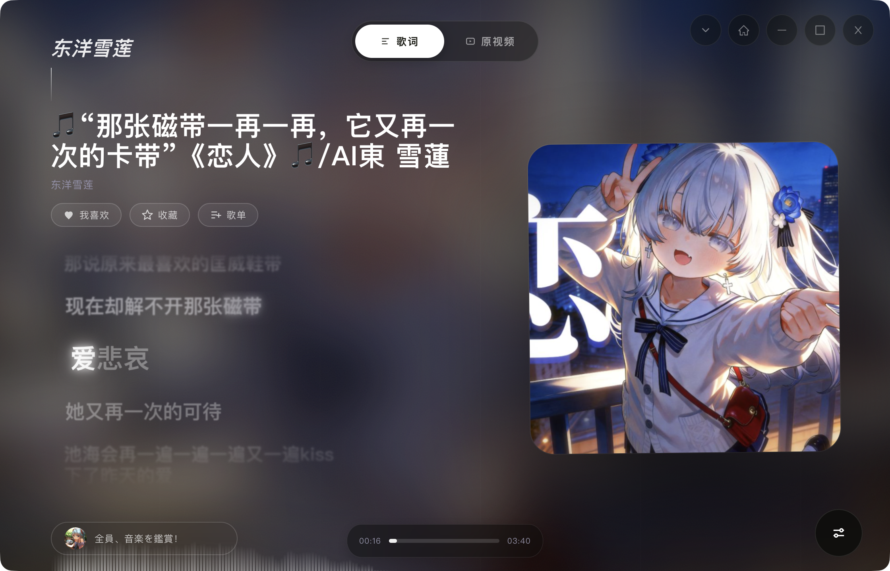
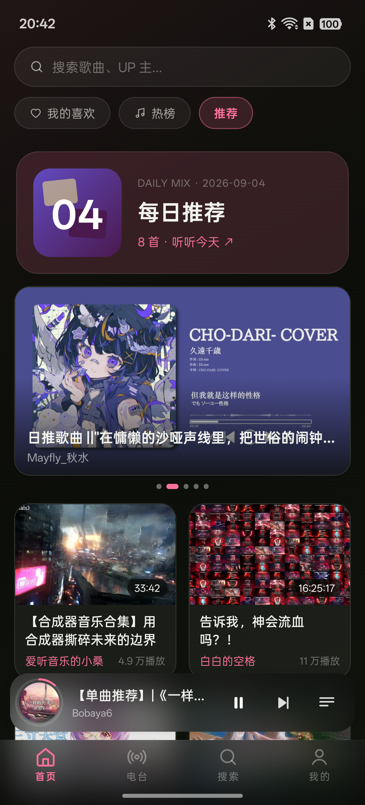
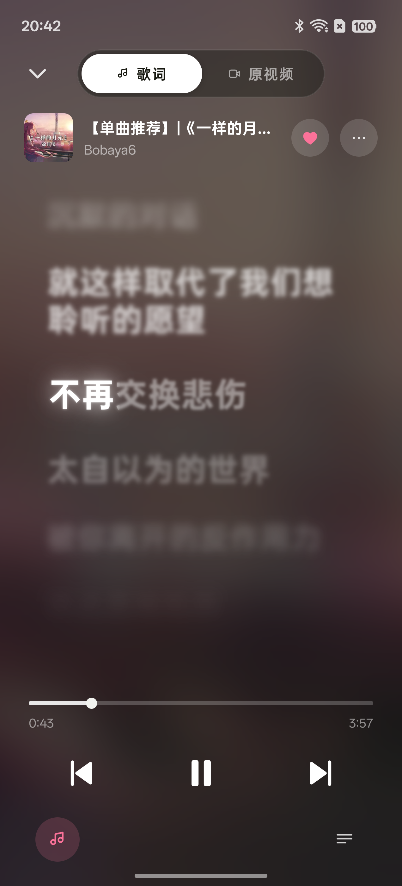

<p align="center">
  
</p>

<p align="center">
  <strong>在电脑和手机上，发现、收藏、听见喜欢的音乐。</strong><br>
  沉浸歌词 · 每日推荐 · 视频分切 · 跨设备同步
</p>

<p align="center">
  <a href="https://github.com/Lyle-xub/biu-player/releases/latest"></a>
  <a href="https://github.com/Lyle-xub/biu-player/issues"></a>
</p>

<p align="center"><sub>macOS · Apple Silicon &nbsp; / &nbsp; Android · arm64</sub></p>

<br>

## 一打开，就是喜欢的音乐

从 B 站发现新歌，把喜欢的视频收入自己的音乐库。首页推荐可以选择音乐分区或全部分区，也能用自己的兴趣画像，找到更合口味的内容。



<br>

## 让歌词，跟着音乐呼吸

封面取色、柔和光晕与逐行滚动，让注意力回到音乐本身。歌词自动优先匹配 QQ 音乐，再尝试网易云和视频字幕；也可以手动选歌、微调时间。



<br>

## 装进口袋，接着听

同样的音乐库，也能带在身边。首页发现新歌，打开歌词沉浸听歌；底部播放栏随时接续播放。

<table>
  <tr>
    <td width="50%" align="center"><strong>手机主页</strong></td>
    <td width="50%" align="center"><strong>手机歌词</strong></td>
  </tr>
  <tr>
    <td align="center"></td>
    <td align="center"></td>
  </tr>
</table>

<p align="center"><sub>以上均为实际运行截图；手机端来自安装正式 APK 后的 Android 实机。</sub></p>

<br>

## 不止一个播放按钮

<table>
  <tr>
    <td width="50%" valign="top">
      <h3>♫ &nbsp;每日一份新鲜感</h3>
      <p>从「日推」视频中按兴趣挑选音乐。查看、调整自己的推荐画像，也可以保存多份不同口味。</p>
    </td>
    <td width="50%" valign="top">
      <h3>♡ &nbsp;把喜欢收好</h3>
      <p>我喜欢、自建歌单、B 站收藏夹和播放历史。编辑、删除、重排，让音乐库按照自己的习惯生长。</p>
    </td>
  </tr>
  <tr>
    <td valign="top">
      <h3>✂ &nbsp;长视频，也能一首首听</h3>
      <p>把合集分成歌曲，查看音频波形、调整分段、识别歌名，再保存为可以连续播放的歌单。</p>
    </td>
    <td valign="top">
      <h3>◉ &nbsp;想看，就回到视频</h3>
      <p>在歌词和原视频之间切换，查看评论、弹幕，点赞、投币、收藏。还可以收听电台、观看直播。</p>
    </td>
  </tr>
  <tr>
    <td valign="top">
      <h3>⌁ &nbsp;同一个家，同一个音乐库</h3>
      <p>手机和电脑登录相同账号、连接同一局域网，开启自动同步，即可同步喜欢、歌单和推荐画像。</p>
    </td>
    <td valign="top">
      <h3>☁ &nbsp;通过 B 站视频云同步</h3>
      <p>把音乐库加密保存到仅自己可见的 B 站视频中，让手机和电脑在不同网络下也能共享收藏与画像。</p>
    </td>
  </tr>
</table>

<p><sub>视频云同步是可选的实验功能；首次配置与桌面所需组件见 <a href="cloud-video/README.md">使用说明</a>。歌词和可播放清晰度以来源实际提供的内容为准。</sub></p>

<br>

## 开始听歌

1. 在 [Releases](https://github.com/Lyle-xub/biu-player/releases/latest) 下载对应的安装包：Mac 选择 `.dmg`，Android 选择 `.apk`。
2. 打开 Biu Player，登录 B 站账号，或先从音乐热榜开始听。
3. 收藏喜欢的歌曲；需要跨设备使用时，在设置中开启同步。

<p>手机支持后台播放、系统媒体控件，以及更轻量的默认歌词效果；桌面端还提供悬浮歌词窗口。</p>

<details>
<summary><strong>想从源码运行？</strong></summary>

桌面端：

```bash
npm install
npm run build:web
npm start
```

移动端使用 Expo 开发构建。详细步骤见 [开发说明](docs/DEVELOPMENT.md) 和 [移动端说明](mobile-rn/README.md)。

</details>

<br>

---

<p align="center">
  <strong>Biu Player</strong><br>
  <sub>非哔哩哔哩官方应用，与哔哩哔哩无官方关联。音乐与视频内容归原作者及平台所有。</sub>
</p>

<p align="center">
  <sub>感谢 <a href="https://github.com/wood3n/biu">wood3n/biu</a>、<a href="https://github.com/SocialSisterYi/bilibili-API-collect">bilibili-API-collect</a> 的接口参考，<br>
  以及 <a href="https://github.com/chthollyphile/folia-major">folia-major</a> 的莫奈歌词动效灵感。</sub>
</p>
